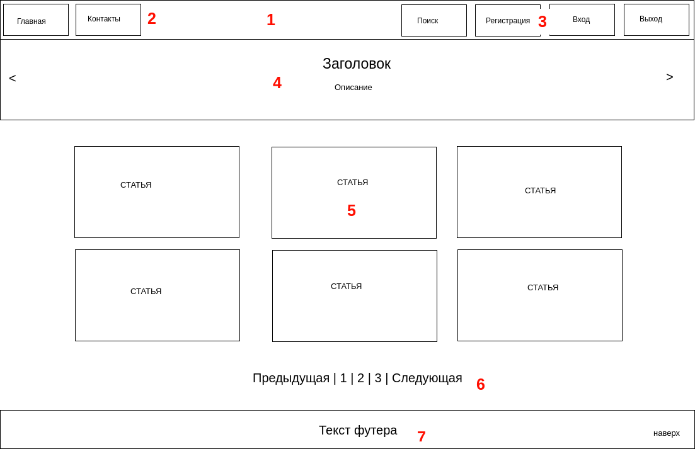
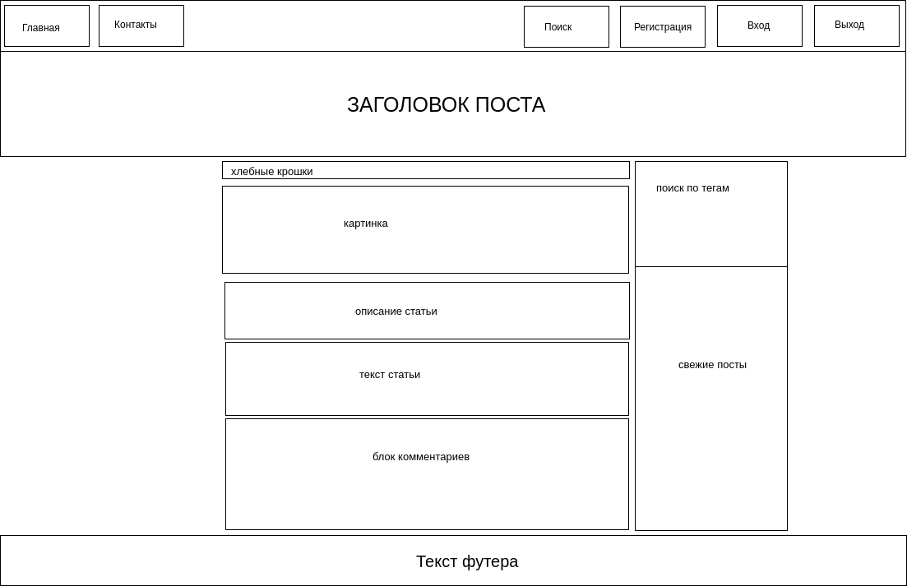
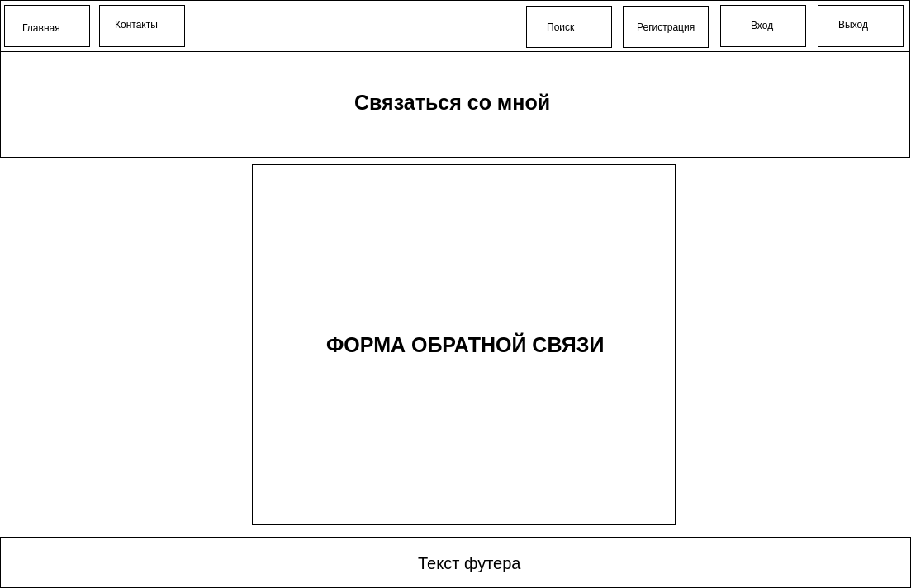
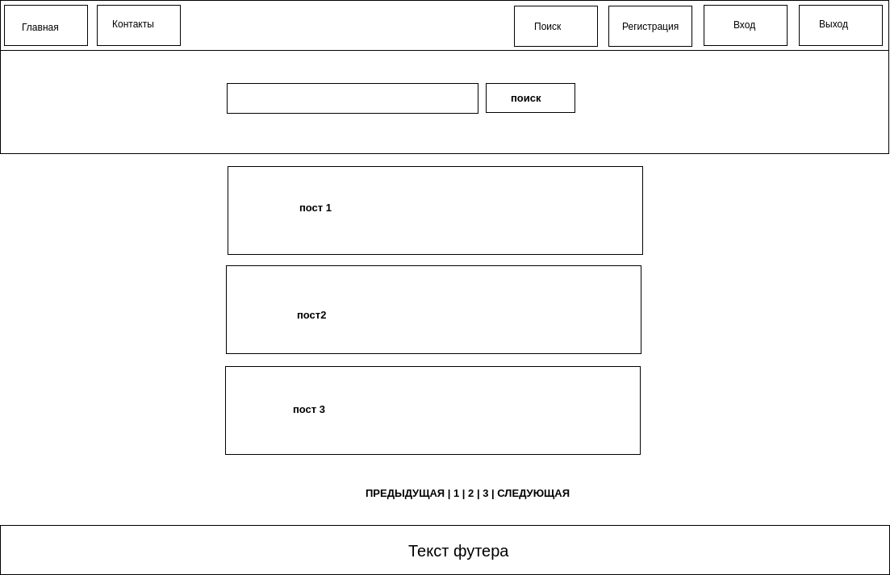
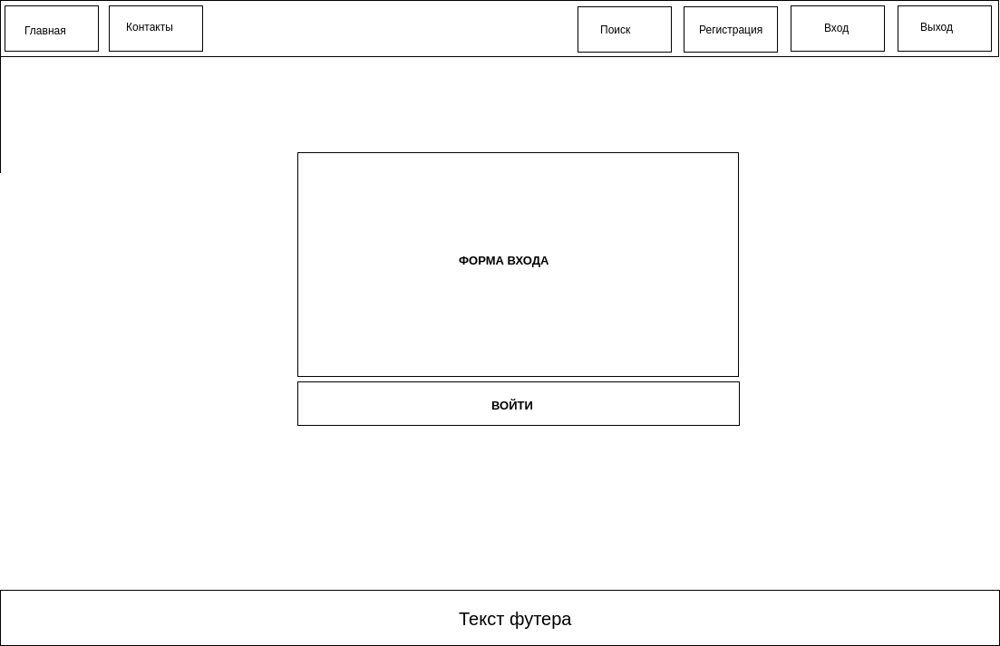
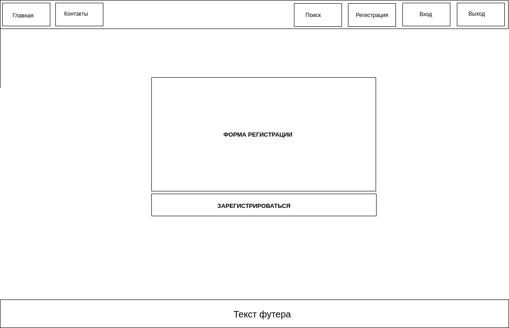

# Макет Bootstrap верстки

> Это **I-часть** из курса по веб-разработке
> на Stepik -- [SPA сайт на Django Rest Framework и NuxtJS](https://stepik.org/course/82067/info)

## home.html - главная страницы

1. Шапка сайта. Она будет разделена на 2 части - левую и правую.
2. Левая часть шапки - главное меню.
3. Правая часть шапки - тут будет поле для поиска,
    кнопка регистрации, авторизации и выхода.
4. Это слайдер сайта. Бесполезная вещь, но чисто в учебных целях мы ее добавим.
5. Здесь у нас будет выводиться список постов.
    Будем например выводить по 6 постов на страницу.
6. Это пагинация.
7. Футер.

## post\_detail.html - страница поста

* **Шапка** - точно такая же как и на главной.
* **Слайдер** - вместо перелистывающегося слайдера сделаем просто хедер
где будет выводить h1 заголовок поста.
* **Тело поста** - в теле будут хлебные крошки,
затем будет идти картинка, краткое описание статьи, текст.
* **Блок комментариев** - после тела статьи будет идти блок комментариев.
* **Правая колонка** - правая колонка будет
разделена на 2 части - верхняя блок с тегами, а нижняя это свежие статьи.
* **Футер** - такой же как и на главной.

## contact.html - страница контакты из главного меню

Данная страница ничем не отличается от главной,
кроме того что вместо списка постов на ней будет форма обратной связи,
а еще тут не нужна пагинация.

## search.html

На странице поиска в шапке будет поле для поиска.
Ниже будет список найденых постов, а под ним пагинация,
если список постов будет превышать 6 записей.

## signin.html - страница входа пользователя

Тут тоже все просто - шапка и футер как и везде, а посередине форма входа.

## signup.html - форма регистрации

Тоже самое что и форма входа.
